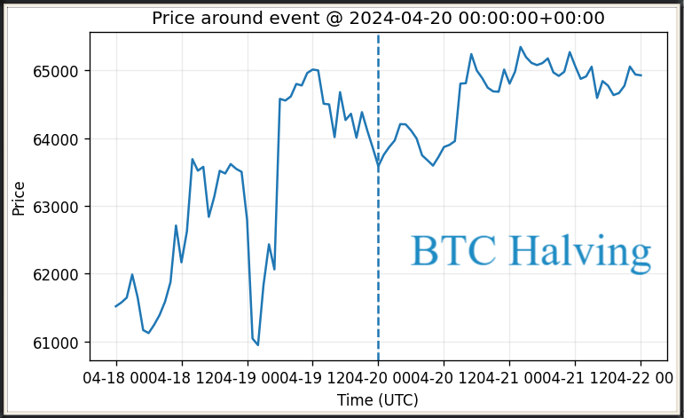
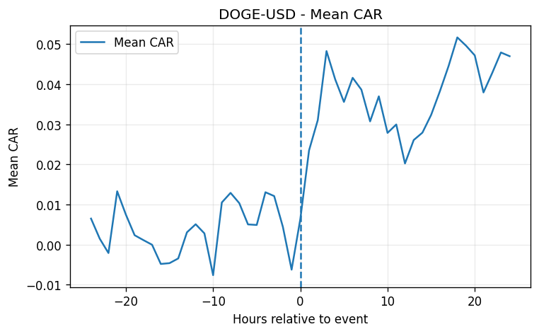

# Crypto Event Study, Short Term Price Impact

  

## What this project is about

This is a pretty standard crypto event study that almost everyone has done. The goal was to see whether major crypto events actually leave a noticeable short-term price footprint. Nothing predictive here, just a structured look at how prices behave around events and a way to experiment with Python and pandas.

## Example Output

  

- Abnormal return (AR) and cumulative abnormal return (CAR) plots 
- Price charts around each event with clear event markers
- Short interpretation text and notes

---

## How it works

1. **Events** – stored in `data_raw/events_sample.csv`  
   Format:  
   `event_id,ts_utc,symbol,category,headline,source,direction`

   Current sample includes:  
   - ETF Approval 
   - Bitcoin Halving
   - Protocol upgrades
   - Exchange Hack  
   - Outages and similar disruptions

2. **Prices** – pulled with yfinance (hourly, ~2 years back)  
3. **Analysis** – returns calculated, AR and CAR estimated
4. **Plots** – visualized with Matplotlib
5. **Report** – everything compiled into an HTML report in `reports/`  

## Running it
Clone and install:
git clone https://github.com/EJursevics/crypto-event-study.git
cd crypto-event-study
python -m venv .venv
.venv\Scripts\activate
pip install -e .

Run the study (PowerShell):
.\run.ps1

This will:
1. Fetch prices
2. Run the event study
3. Save figures into reports/figures
4. Build reports/event_study_report.html

## What is happening here
- Pipeline from raw data -> analysis -> reporting  
- A classic finance method applied to crypto
- Python, Pandas, yfinance, Matplotlib used for analysis and visualization  

### Built mainly as a learning project, but kept structured and reproducible.
